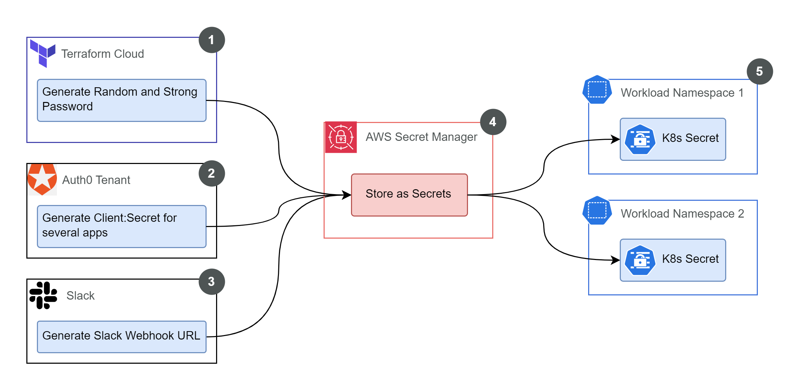

# EKS Cluster Architecture in the Spoke Account

|             |                           |
| ----------- | ------------------------- |
| **Version** | 1.0                       |
| **Date**    | 2025-06-08                |
| **Owner**   | Cloud Infrastructure Team |
|             |                           |

## 1. Background and Rationale

|                   |                                                                                                              |
| ----------------- | ------------------------------------------------------------------------------------------------------------ |
| **Goal**          | Deliver scalable, secure, production-grade geospatial data science workloads                                 |
| **Core Strategy** | Deploy Kubernetes using AWS Elastic Kubernetes Service (EKS) in dedicated AWS accounts (Dev, Staging, Prod). |
|                   |                                                                                                              |

### Decisions & Justifications:

- **1. Kubernetes Adoption:**

  - Utilizes the industry-standard platform for container orchestration.
  - Essential for managing complex, data-intensive geospatial tasks.
  - Provides robust orchestration, declarative configuration, and strong ecosystem support.

- **2. AWS EKS Selection:**

  - Leverages a managed Kubernetes control plane, reducing operational burden.
  - Integrates natively with AWS VPC (networking) and IAM (identity).
  - Enables scaling from small test clusters to large production environments.

- **3. Multi-Account Strategy (Dev, Staging, Prod):**

  - Separates environments for enhanced security and stability.
  - Limits the potential impact (blast radius) of issues within one environment.
  - Facilitates clear cost tracking per environment.
  - Ensures identical architecture across environments, simplifying the promotion process (Dev -> Staging -> Prod).

- **4. Infrastructure as Code (IaC) Implementation:**

  - Employs IaC best practices using Terraform for repeatable, transparent, and version-controlled infrastructure.
  - **Choosen Tool:** Uses Terraform Stacks (currently in beta).
    - Chosen for its ability to abstract configuration into modular components, enhancing clarity.
    - Streamlines the process of consistent deployments across multiple environments.

- **5. Hub-and-Spoke Integration:**

  - EKS clusters (in spoke accounts) integrate with the central hub account.
  - Consumes shared services (DNS, ECR, networking) from the hub, reducing duplication.
  - Simplifies management of shared resources, security, and compliance.

- **6. Repository Strategy:**

  A clear separation of concerns between foundational infrastructure provisioning and application lifecycle management:

  - **Foundational provisioning** is managed in the [piksel-infra repository](https://github.com/piksel-ina/piksel-infra) using Infrastructure as Code (**Terraform**). This repository is responsible for setting up all core AWS and Kubernetes resources, enforcing security best practices, and establishing the baseline environment.
  - **Application deployment and configuration** are handled in the [piksel-gitops repository](https://github.com/piksel-ina/piksel-gitops) using GitOps principles. **Flux CD** continuously monitors this repository and ensures that all application workloads and HelmReleases are deployed to the appropriate namespaces and clusters, keeping the live environment in sync with the declared desired state.

## 2. Architecture Diagram

### 2.1. Diagram

### 2.2 Explanation (by diagram number)

**1. AWS Account**  
This illustration uses the Dev account as an example, but the same implementation is applied to Staging and Production environments. Each environment is fully isolated within its own AWS account, providing clear separation of resources, security boundaries, and cost tracking.

**2. VPC & Subnets**  
Each EKS cluster is deployed into a dedicated VPC with private subnets spanning multiple Availability Zones for high availability. Every environment (Dev, Staging, Production) uses a unique CIDR block to ensure network isolation and prevent IP conflicts. For more details on the networking and multi-account setup, refer to:

- [Piksel Multi Account Setup](https://github.com/piksel-ina/piksel-document/blob/main/architecture/hub-spoke-design.md)
- [Piksel Spoke Network](https://github.com/piksel-ina/piksel-document/blob/main/architecture/spoke-network-design.md)

**3. EKS Cluster**

The EKS cluster is the core compute resource within the VPC:

- **Name**: The cluster name is variable-driven for consistency across environments.
- **Version**: Controlled via var.eks-version to ensure all clusters use the desired Kubernetes version.
- **Endpoint**: Public API access is enabled for flexibility, while workloads themselves run in private subnets.
- **Network**: The cluster leverages existing VPC and private subnets for all node and pod networking.
- **Security**: No custom security groups are defined; the cluster relies on its primary security group for control.

**4. AWS IAM & OIDC Provider**  
IAM roles and policies are tightly scoped, following least privilege. The OIDC provider enables IRSA (IAM Roles for Service Accounts), so workloads get fine-grained AWS permissions.

_Note: See each component’s documentation for details on IRSA usage._

**5. Fargate Profiles**  
To simplify node management and ensure high availability independent of EC2 node group scaling, several core system workloads run on AWS Fargate.

- This is achieved by creating Fargate Profiles that target specific `namespaces`.
- It is essential that the following namespaces are **defined and created within the Terraform** configuration; otherwise, the Fargate Profiles will not be able to schedule pods into them:
  - [**kube-system**](./eks-addons.md): Houses core Kubernetes services like CoreDNS, kube-proxy, VPC CNI, and the EBS CSI controller (~8-15 pods).
  - **karpenter**: Runs the Karpenter autoscaler controller (~1-2 pods).
  - **flux-system**: Contains the GitOps controllers managed by FluxCD (~5-8 pods).
  - **aws-external-dns-helm**: Hosts the ExternalDNS controller responsible for managing DNS records (~1-2 pods).

**6. Node Groups**  
Node groups provide EC2-based compute for workloads that require custom resources or cannot run on Fargate. They are configured in karpenter for autoscaling, including scaling down to zero when idle to save costs.

- **Auto-scaling:** Scale to zero when idle to minimize cost.
- **AMI:** Amazon Linux 2023, version pinned for stability.
- **Storage:** 120GB gp3 SSD, encrypted.
- **Default NodePool:** Supports compute, memory, and burstable instances (c, m, r, t families).
- **GPU NodePool:** Dedicated to AI/ML workloads (g5.xlarge, g5.2xlarge, g5.4xlarge), up to 30 GPUs.

This approach supports a mix of lightweight and heavy data processing workloads, including on-demand scaling for machine learning and analytics, while controlling costs and complexity.

**7. EBS Volume**  
The EBS CSI driver (in kube-system) manages dynamic EBS volume provisioning. Node groups claim these volumes for stateful workloads, ensuring persistent and reliable storage.

**8. Namespaces & Workloads**  
Namespaces organize workloads for security and manageability. Each namespace hosts a focused service or component. For detailed implementation, see:

- `database:` Database-related services (see [database workload details](#database-workload))
- `jupyterhub:` Interactive data science environment ([jupyterhub workload details](#jupyterhub-workload))
- `odc:` Open Data Cube services ([odc workload details](#odc-workload))
- `terria:` Geospatial web platform ([terria workload details](#terria-workload))
- `monitoring:` Monitoring and observability tools ([monitoring workload details](#monitoring-workload))
- `odc-stac:` STAC API integration for data catalog ([odc-stac workload details](#odc-stac-workload))
- `argo:` Workflow automation and pipelines ([argo workload details](#argo-workload))

**9. RDS PostgreSQL**  
A managed RDS PostgreSQL instance provides persistent, reliable database storage. A Kubernetes endpoint is configured, allowing EKS workloads to securely connect to the database.

**10. S3: Satellite Data**  
A public S3 bucket hosts satellite data products, enabling easy retrieval by users and applications.

**11. S3: Argo Artifacts**  
Argo workflows use this S3 bucket to store workflow artifacts for reproducibility and traceability.

**12. S3: Terria**  
A dedicated S3 bucket supports Terria’s web assets and configuration.

## General Foundational Setup via Terraform

The foundational setup, automated through Terraform in the [piksel-infra](https://github.com/piksel-ina/piksel-infra) repository, is designed to provide a secure and production-ready environment for workloads. By defining all resources as code, the platform ensures consistency, traceability, and the ability to rapidly reproduce environments.

**Terraform provisions the following core resources:**

- **Namespace Creation:**  
  All required Kubernetes namespaces are created up front to support workload separation, Fargate profiles, and IRSA integration.

- **IAM Roles for Service Accounts (IRSA):**  
  Secure IAM roles are created and mapped to Kubernetes service accounts, enabling workloads to assume AWS permissions following least-privilege principles.

- **AWS Service Resources:**  
  Essential AWS-managed services (such as RDS, S3 buckets, and EBS storage) are provisioned and configured to be ready for workload consumption.

- **Password and Authentication Credentials:**
  - **Automatically generated:** Terraform (or Terraform Cloud) automatically generates strong, random passwords and stores them in AWS Secrets Manager.
  - **Manually created:** Some secrets, such as Auth0 client secrets and Slack webhook URLs, must be generated manually in their respective platforms due to external constraints. After manual creation, these secrets are securely stored in AWS Secrets Manager via Terraform input.

Once stored in AWS Secrets Manager, all secrets—whether generated automatically or manually—are synchronized into the appropriate Kubernetes namespaces as K8s Secrets, making them available to workloads as needed.

### Secrets Flow Diagram

**Explanation:**

1. **Terraform Cloud**: Generates strong, random passwords (automated).
2. **Auth0 Tenant**: Client secrets for several apps are generated manually in the Auth0 dashboard, then stored in AWS Secrets Manager.
3. **Slack**: Webhook URLs are generated manually in the Slack platform and stored in AWS Secrets Manager.
4. **AWS Secrets Manager**: Central store for all secrets, both automated and manual.
5. **Kubernetes Namespaces**: Secrets are synced and made available as K8s Secrets in the appropriate namespaces for workloads.

## 4. Security Considerations

This section outlines security measures implemented at the AWS infrastructure and EKS cluster level, forming the foundational security posture. It also details planned future enhancements at this level.

### 4.1. Foundational Security Measures (Cluster Level)

A secure baseline is established using the following AWS and EKS features, enabling rapid deployment while providing essential protection.

**Important Disclaimers:**

- **Network Security:** Detailed network controls (Security Groups, NACLs, etc.) are in the [Spoke Network Design document](https://github.com/piksel-ina/piksel-document/blob/main/architecture/spoke-network-design.md#4-security-considerations).
- **Component-Specific Security:** Granular security configurations _within_ the cluster (e.g., specific RBAC roles for applications, detailed Network Policies between specific services) will be detailed in the documentation for each respective component/workload.

Current foundational security practices:

- **Account Isolation:** Separate AWS accounts (Dev, Staging, Prod) provide strong boundaries, limiting the blast radius of potential security incidents.
- **IAM Least Privilege & IRSA (IAM Roles for Service Accounts):** Tightly scoped IAM roles are used. IRSA allows Kubernetes service accounts to assume these IAM roles directly via an OIDC identity provider. This **enhances security by eliminating the need to store long-lived AWS access keys within pods**, instead relying on temporary, automatically rotated credentials specific to the service account's needs .
- **Private Subnet Deployment:** EKS nodes and core workloads reside in private subnets, minimizing direct internet exposure and relying on controlled egress/ingress points like NAT Gateways and Load Balancers.
- **Encryption at Rest:** Data on EBS volumes (attached to EKS nodes) and RDS database instances is encrypted using AWS Key Management Service (KMS), protecting data confidentiality if physical storage is compromised.
- **Managed Control Plane (EKS):** Leveraging EKS means AWS manages the security, patching, availability, and scalability of the Kubernetes control plane components (API server, etcd, etc.). This **shifts the operational burden and responsibility for control plane security vulnerabilities and maintenance from the user to AWS**.
- **Secrets Management Strategy:**
  - **AWS Secrets Manager:** Used for storing highly sensitive external secrets like database passwords and third-party API keys (e.g., Auth0 client secrets), leveraging AWS's managed service for rotation and auditing.
  - **Kubernetes Secrets:** Employed for application configuration details and internal credentials where appropriate, using base64 encoding (note: not true encryption, relies on RBAC for access control).
  - **Secure Generation:** Random generation practices are used for creating secure passwords and tokens where applicable.
- **Namespace Segmentation:** Kubernetes namespaces provide logical workload separation, forming a basis for applying future policies and cluster-level RBAC.

### 4.2. Future Security Enhancements (Cluster/Platform Level)

Certain cluster-wide security features were deferred for faster initial deployment. Future enhancements planned at the cluster/platform level include:

**High Priority:**

- **Network Policies:** Implement a CNI supporting Network Policies (e.g., Calico) to enable baseline pod-to-pod network restrictions within the cluster.
- **Container Image Scanning:** Integrate automated vulnerability scanning for images deployed to the cluster within the CI/CD pipeline (e.g., ECR Scan, Trivy).
- **Runtime Security Monitoring:** Deploy cluster-wide threat detection (e.g., Falco, GuardDuty for EKS).
- **Enhanced Cluster Logging/Auditing:** Centralize and enhance EKS control plane logs, audit logs, and potentially node-level security logs.

**Medium Priority:**

- **Cluster RBAC Audits:** Regularly review cluster-wide Kubernetes RBAC roles and bindings (e.g., `cluster-admin`, default roles).
- **Policy Enforcement (Admission Controllers):** Implement cluster-wide policies via admission controllers (e.g., Gatekeeper, Kyverno) to enforce security standards (e.g., disallow privileged pods).
- **Cluster Compliance Checks:** Audit EKS configuration against benchmarks (e.g., CIS Kubernetes Benchmark).

**Nice to Have:**

- **Service Mesh:** Consider for cluster-wide mTLS, advanced traffic control (e.g., Istio, Linkerd).

### 4.3. Ongoing Security Posture Management

Security requires continuous monitoring and improvement at the infrastructure and cluster level.

It is **strongly recommended** to have _dedicated personnel_ or _a security team_ responsible for ongoing monitoring, auditing, vulnerability management, incident response related to the EKS platform, and implementing these future enhancements.

## 5. Related Documents

- [Piksel Multi Account Setup](https://github.com/piksel-ina/piksel-document/blob/main/architecture/hub-spoke-design.md)
- [Piksel Spoke Network](https://github.com/piksel-ina/piksel-document/blob/main/architecture/spoke-network-design.md)
- [EKS Add-ons Setup](./eks-addons.md)
- [jupyterhub workload details](#jupyterhub-workload)
- [odc workload details](#odc-workload)
- [terria workload details](#terria-workload)
- [monitoring workload details](#monitoring-workload)
- [odc-stac workload details](#odc-stac-workload)
- [argo workload details](#argo-workload)
