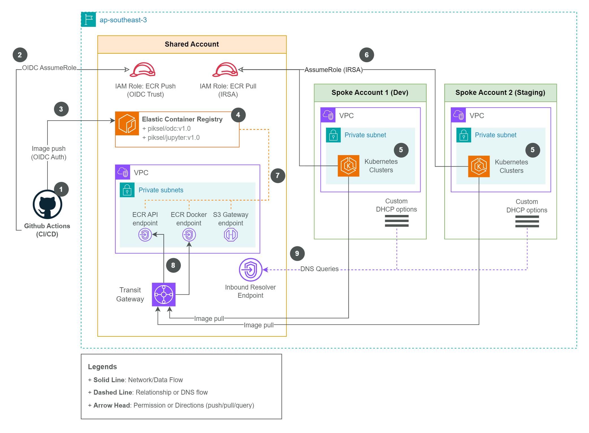

# Piksel AWS Hub-and-Spoke Architecture: Centralized DNS, ECR, and Secure Transit Gateway Networking

|             |                           |
| ----------- | ------------------------- |
| **Version** | 1.0                       |
| **Date**    | 2025-05-22                |
| **Owner**   | Cloud Infrastructure Team |

---

## 1. Background and Rationale

To achieve a secure, manageable, and scalable cloud environment, Piksel adopts a multi-account AWS architecture.

- **Multi-Account Structure**  
  Workloads are separated by account to enhance security, minimize the impact of potential errors, and simplify cost allocation. This structure also enforces environment separation (e.g., development, staging, production) and supports compliance requirements.
- **Hub-and-Spoke Model**  
  The hub-and-spoke model centralizes shared services, reduces duplication, and simplifies network management. In this architecture, the following services are centralized in the hub account:
  - Centralized management of internal DNS zones and resolvers.
  - A single ECR repository for all container images.
  - Centralized routing and connectivity for all VPCs and accounts through Transit Gateway (TGW).
  - Shared roles for CI/CD and cross-account access.
  - Centralized collection of logs (e.g., VPC Flow Logs, DNS query logs) for enhanced visibility and compliance.
- **Central Shared Account (Hub)**  
  A central "shared" account functions as the hub, providing resources and services accessed by multiple spoke accounts. This centralization streamlines management and strengthens security controls.
- **Terraform Stacks**  
  Infrastructure is managed using Terraform Stacks, a new feature that introduces a distinct workflow compared to traditional Terraform Cloud workspaces. Stacks enable clear separation and independent management of infrastructure components, allowing deployments to different environments without configuration duplication.
  - [piksel-hub](https://github.com/piksel-ina/piksel-hub) (_upstream_): Provisions shared resources in the hub account.
  - [piksel-infrastructure](https://github.com/piksel-ina/piksel-infra) (_downstream_): Provisions resources in spoke accounts, consuming outputs from the hub stack.  
    Each stack resides in a separate GitHub repository, which adds complexity but improves maintainability and control.

---

## 2. Centralized DNS and Networking

### Overview

- A centralized DNS and networking architecture is implemented to ensure consistent name resolution and secure, scalable connectivity across all AWS accounts and environments. The design leverages AWS Route 53 Resolver, private and public hosted zones, and AWS Transit Gateway (TGW) to enable seamless DNS resolution and VPC-to-VPC communication.\

### Diagram

### Notes and Explanation (Referencing Diagram Numbers)

1. **On-premise DNS server**\
   The on-premise DNS server can delegate specific zones to AWS Route 53 name servers, enabling hybrid DNS resolution between on-premises and AWS environments.
2. **Route 53 Public Hosted Zones**\
   Two public hosted zones are created in the shared account, these zones manage public-facing DNS records:
   - _piksel.big.go.id_
   - _app.piksel.big.go.id_\
3. **Route 53 Private Hosted Zones**\
    Private hosted zones are centralized in the shared account, and these zones are associated with the appropriate spoke VPCs to provide internal DNS resolution.
   - _piksel.internal_
   - _dev.piksel.internal_
   - _prod.piksel.internal_
   - _add as needed_
4. **PHZ Association**\
   Private hosted zones are associated with VPCs in spoke accounts (e.g., Dev, Staging, Prod) to extend internal DNS resolution across accounts.
5. **Route 53 Resolver Inbound Endpoint**\
   An inbound resolver endpoint is deployed in the shared account, allowing DNS queries from spoke VPCs to resolve records in the centralized private hosted zones.
6. **Custom DHCP Options**\
   Spoke VPCs are configured with custom DHCP options sets that direct DNS queries to the inbound resolver endpoint in the shared account, while still maintain the default `AmazonProvidedDNS`.
7. **Transit Gateway (TGW)**\
   A TGW is deployed in the shared account, serving as the networking backbone for full-mesh connectivity between all VPCs (shared and spokes). This also enable scaling and connecting with op-premise infrastructure in the future.
8. **TGW Attachment**\
   The TGW is attached to all participating VPCs, enabling secure, scalable, and isolated network communication.
9. **Route Tables**\
   VPC route tables are configured to direct inter-VPC traffic via the TGW, and DNS traffic via the correct resolver endpoints.

### Implementation in Terraform

- **Route 53 Hosted Zones**:
  - Public and private hosted zones are defined in the shared account stack (piksel-hub).
  - Private zones are associated with spoke VPCs using cross-account resource associations.
- **Route 53 Resolver Endpoints**:
  - Inbound resolver endpoints are provisioned in the shared account.
  - Security groups and IAM roles are configured to allow DNS queries from spoke VPCs.
- **Transit Gateway**:
  - TGW is created in the shared account.
  - TGW attachments and route table associations are managed for all VPCs (shared and spokes).
- **Custom DHCP Options**:
  - DHCP option sets are defined in each spoke VPC to point DNS resolution to the shared account’s inbound resolver endpoint.
- **Testing Infrastructure**:
  - EC2 instances are deployed in both shared and spoke VPCs to validate DNS resolution and connectivity.
- **Terraform Stacks Structure**
  - piksel-hub (Upstream):\
    Provisions shared resources (TGW, hosted zones, resolver endpoints) and outputs necessary values (e.g., TGW ID, hosted zone IDs, resolver endpoint IPs).
  - piksel-infrastructure (Downstream):\
    Provisions spoke VPCs, associates them with shared hosted zones, attaches them to the TGW, and configures DHCP options. Consumes outputs from piksel-hub.

### Key Outcomes

- **Centralized DNS and networking** simplifies management, enhances security, and ensures consistent configuration across all environments.
- **Full-mesh VPC connectivity and seamless cross-account DNS resolution** are achieved with minimal operational overhead.
- **The modular Terraform stacks** approach enables clear separation of responsibilities and predictable infrastructure updates.

> References:
>
> - [AWS Documentation: Scaling DNS Management Across Multiple Accounts](https://docs.aws.amazon.com/whitepapers/latest/hybrid-cloud-dns-options-for-vpc/scaling-dns-management-across-multiple-accounts-and-vpcs.html)
> - [How to associate multi account VPC and a phz](https://docs.aws.amazon.com/Route53/latest/DeveloperGuide/hosted-zone-private-associate-vpcs-different-accounts.html).

---

## 3. Centralized ECR Management

### Overview

A centralized Amazon Elastic Container Registry (ECR) is deployed in the Shared Account to securely store and manage container images for all environments. This setup integrates with CI/CD pipelines via GitHub Actions (OIDC), leverages scoped IAM roles, and uses VPC endpoints to ensure all ECR and S3 traffic remains private within AWS.

### Diagram

## 

### Notes and Explanation (Referencing Diagram Numbers)

1. **GitHub Actions (CI/CD)**  
   CI/CD workflows are triggered in GitHub Actions to build and push container images.

2. **OIDC AssumeRole**  
   GitHub Actions uses OpenID Connect (OIDC) to securely assume an IAM role in AWS for ECR push operations.

3. **Image Push (OIDC Auth)**  
   Built images are pushed from CI/CD pipelines to the centralized ECR repository using OIDC-authenticated credentials.

4. **Elastic Container Registry (ECR)**  
   The Shared Account hosts a private ECR repository (e.g., `piksel/odc:v1.0`, `piksel/jupyter:v1.0`) for all environments.

5. **Kubernetes Clusters (Spoke Accounts)**  
   Spoke accounts (Dev, Staging, Prod) run Kubernetes clusters configured to pull images from the centralized ECR.

6. **AssumeRole (IRSA)**  
   EKS workloads in Spoke Accounts assume a read-only IAM role using IRSA (IAM Roles for Service Accounts) to pull images from ECR.

7. **VPC Endpoints (ECR & S3)**  
   VPC interface endpoints for ECR API, ECR Docker, and S3 Gateway are provisioned in the Shared Account VPC, ensuring private network access to ECR and S3.

8. **Transit Gateway**  
   The Transit Gateway provides full-mesh connectivity between Shared and Spoke VPCs, allowing secure, private ECR image pulls by workloads in Spoke VPCs.

9. **Inbound Resolver Endpoint**  
   DNS queries from Spoke VPCs are forwarded to the inbound resolver in the Shared Account, enabling successful resolution of ECR and S3 endpoint hostnames.

---

### Terraform Implementation

- **ECR Repository**
  - Defined in the Shared Account with lifecycle policies for image management.
- **GitHub Actions OIDC Integration**
  - OIDC provider and IAM roles are created in AWS IAM, with trust policies scoped to specific repositories.
  - Roles grant push (write) access for CI/CD, and pull (read) access for EKS workloads.
- **VPC Endpoints**
  - ECR API and Docker endpoints, plus S3 Gateway endpoint, are deployed in the Shared VPC.
- **DNS Resolution**
  - Spoke VPCs use custom DHCP options to point to the Shared Account’s inbound resolver endpoint, ensuring correct DNS resolution for ECR/S3 endpoints.
- **Transit Gateway**
  - Connects Shared and Spoke VPCs, enabling private network flows for image pulls.

### Key Outcomes

- **Centralized ECR** simplifies image management and enforces consistent security policies.
- **Private VPC Endpoints** ensure all image operations remain within AWS, enhancing security and reducing latency.
- **CI/CD Integration** with OIDC and scoped IAM roles provides secure, automated image delivery.
- **DNS and Networking** are configured for seamless cross-account access, supporting scalable multi-environment deployments.

---

## 5. **TGW Considerations and Security Plan**

- **Account and Environment Isolation**  
  TGW route tables are structured to ensure that only authorized VPCs can communicate, maintaining strict separation between development, staging, and production environments.
- **Security Controls**  
  Network ACLs, Security Groups, and IAM policies are implemented to restrict access. Only approved network traffic is permitted between VPCs and accounts.
- **Monitoring and Auditing**  
  VPC Flow Logs, Route 53 query logs, and AWS CloudTrail are enabled to provide comprehensive visibility and support compliance requirements. Regular reviews are conducted to identify and address potential issues.
- **Governance**  
  Changes are documented and permissions are reviewed regularly to ensure ongoing security as the environment evolves.

---

## 6. **Conclusion and Next Steps**

This architecture establishes a secure and scalable foundation for Piksel’s cloud workloads. Centralization of DNS and ECR, combined with Transit Gateway-based networking, streamlines management and enhances security.  
**Next steps:** Continue automation of processes, conduct regular security reviews, and maintain up-to-date documentation as the environment evolves.

---

## 7. **Appendices**

- **Architecture Diagrams:** (Attach latest network and DNS diagrams)
- **Terraform Examples:** (Include sample module and stack definitions)
- **Policy Templates:** (Sample IAM, VPC endpoint, and DNS policies)

---

Let me know if further adjustments are needed or if a different format is required.
