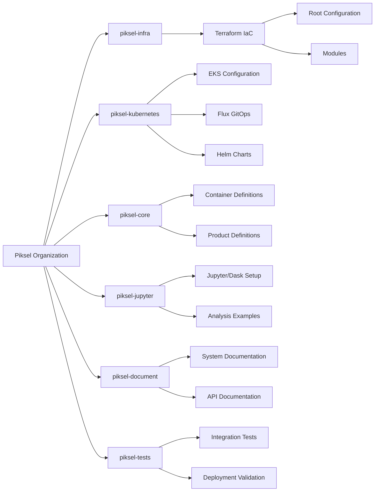
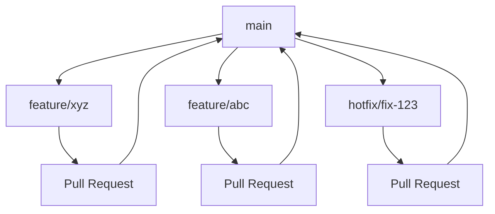
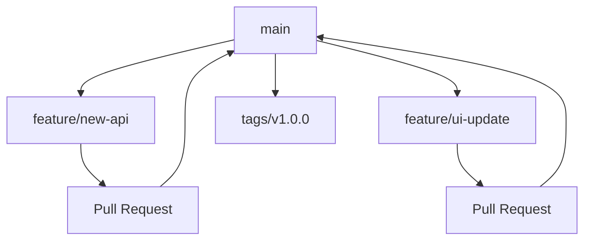
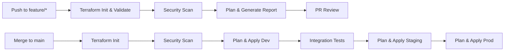
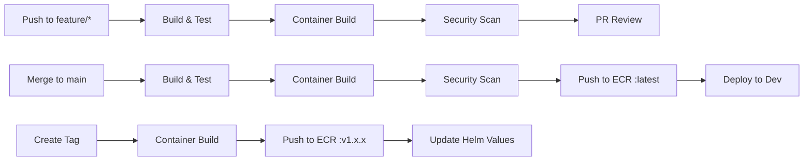
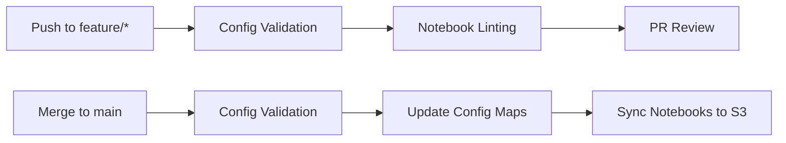
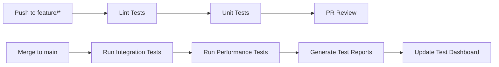

# Piksel Project Repository and CI/CD Strategy

## Overview

This document outlines the proposed multi-repository architecture for the Piksel Earth Observation Data platform. The strategy balances separation of concerns with system-wide coordination to enable efficient development and deployment of all components.

## Repository Structure



## Repository Details

### 1. `piksel-infra`

Infrastructure as Code repository containing all AWS resource definitions.

<!-- prettier-ignore-start -->
```markdown
piksel-infra/
├── .github/
│   └── workflows/
│       └── tf-validate.yml     # Only format and validation checks
├── .gitignore
├── .pre-commit-config.yaml
├── README.md
├── modules/                    # Only for complex/unique configurations
│   └── custom-setup/           # Example: Special configuration needed
│       ├── main.tf
│       ├── variables.tf
│       └── outputs.tf
├── dev/
│   ├── README.md               # Dev environment specifics
│   ├── main.tf                 # Uses registry modules
│   ├── variables.tf
│   ├── outputs.tf
│   ├── providers.tf
│   └── terraform.tfvars
├── staging/
│   └── [same structure as dev]
└── prod/
    └── [same structure as dev]
```
<!-- prettier-ignore-end -->

### 2. `piksel-core`

Open Data Cube core services repository.

<!-- prettier-ignore-start -->
```markdown
piksel-core/
├── docker/                     # Container definitions for ODC
├── products/                   # Earth observation product definitions
└── .github/workflows/          # Core services CI/CD pipelines
```
<!-- prettier-ignore-end -->

### 3. `piksel-jupyter`

Custom Jupyter environment with Dask integration.

<!-- prettier-ignore-start -->
```markdown
piksel-jupyter/
├── config/                     # JupyterHub/Dask config
├── notebooks/                  # Example and template notebooks
└── .github/workflows/          # Jupyter image CI/CD pipelines
```
<!-- prettier-ignore-end -->

### 4. `piksel-kubernetes`

Kubernetes and GitOps management:

<!-- prettier-ignore-start -->
```markdown
piksel-kubernetes/
├── terraform/         # EKS infrastructure
├── helm-charts/       # Application Helm charts
│   ├── core/          # Core service charts
│   ├── addons/        # Cluster add-on charts
│   └── values/        # Environment-specific values
├── flux/              # Flux GitOps configurations
└── docs/              # Kubernetes-specific documentation
```
<!-- prettier-ignore-end -->

### 5. `piksel-website`

Landing page and documentation site.

<!-- prettier-ignore-start -->
```markdown
piksel-website/
├── public/                     # Static website content
└── .github/workflows/          # Website deployment workflows
```
<!-- prettier-ignore-end -->

### 6. `piksel-tests`

Testing and validation:

<!-- prettier-ignore-start -->
```markdown
piksel-tests/           # [Rename from piksel-test]
├── integration-tests/  # Cross-service test suites
├── performance-tests/ # Load testing and benchmarks
├── environments/      # Test environment configurations
└── docs/             # Testing documentation
```
<!-- prettier-ignore-end -->

### 7. `piksel-document`

Centralized documentation:

<!-- prettier-ignore-start -->
```markdown
piksel-document/
├── security/           # Security foundations, policies, compliance
├── project-plans/      # Project plans, milestones 
├── achitecture/        # System architecture
├── operations/         # Runbooks, procedures, how-tos
├── assets/             # Logos, and etc
└── api/                # API documentation
```
<!-- prettier-ignore-end -->

## Branching Strategy

### Infrastructure Repositories (piksel-infra, piksel-kubernetes)



**Branch Protection Rules**

- **Main Branch** (`main`)

  - Require a pull request before merging
    - Required number of approvals: 1
    - Dismiss stale pull request approvals when new commits are pushed
  - Require status checks to pass before merging
    - Require branches to be up to date before merging
    - Required status checks: build, test
  - Do not allow bypassing the above settings

- **Feature Branches** (`feature/*`)
  - Standard pull request workflow
  - No specific protection rules

### Application Repositories (piksel-core, piksel-jupyter)



**Branch Protection Rules**

- **Main Branch**

  - Require a pull request before merging
    - Required number of approvals: 1
    - Dismiss stale pull request approvals when new commits are pushed
  - Require status checks to pass before merging
    - Require branches to be up to date before merging
    - Required status checks: build, test
  - Do not allow bypassing the above settings

- **Feature Branches** (`feature/*`)
  - Standard pull request workflow
  - No specific protection rules

### Directory Structure (Infrastructure)

```
repository/
├── environments/
│   ├── dev/
│   ├── staging/
│   └── prod/
├── modules/
└── shared/
```

### Workflow Guidelines

1. **Feature Development**

   - Create feature branch from main
   - Submit pull request when ready
   - Get approval from 1 reviewer
   - Ensure status checks pass
   - Merge to main

2. **Release Process**

   - Infrastructure: Update appropriate environment directory
   - Applications: Create new tag (v1.0.0, v1.1.0, etc.)

3. **Hotfix Process**
   - Create hotfix branch from main
   - Follow same PR process as features
   - Deploy after merge
     Based on your current setup, I'll help structure the CI/CD strategy that aligns with your repository and branching strategy. Let's break it down by repository type:

## CI/CD Strategy

### 1. Infrastructure Repositories CI/CD (piksel-infra, piksel-kubernetes)



**GitHub Actions Workflow Structure**

```yaml
# Feature Branch Workflow
name: Feature Branch Checks
on:
  pull_request:
    branches: [main]
    paths:
      - 'environments/**'
      - 'modules/**'

jobs:
  validate:
    runs-on: ubuntu-latest
    steps:
      - terraform-init
      - terraform-validate
      - tfsec-scan
      - terraform-plan

# Main Branch Workflow
name: Environment Deployment
on:
  push:
    branches: [main]
    paths:
      - 'environments/**'

jobs:
  deploy-dev:
    environment: dev
    steps:
      - terraform-apply
      - integration-tests

  deploy-staging:
    needs: deploy-dev
    environment: staging
    steps:
      - terraform-apply

  deploy-prod:
    environment:
      name: production
      url: https://piksel.example.com
    needs: [deploy-staging]
    steps:
      - manual-approval
      - deploy

```

**Key Components**

- **Authentication:**
  - Terraform Cloud manages AWS authentication via OIDC
  - GitHub Actions authenticates with Terraform Cloud via API tokens
- **State Management**:
  - Separate Terraform Cloud workspaces per environment
  - State locked and managed in Terraform Cloud
- **Security:**
  - tfsec and checkov scans in PR checks
  - Infrastructure policy checks via Terraform Cloud
- **Environment Protection**:
  - Required approvals in Terraform Cloud for staging/prod
  - Manual approval gates between environments

**Monitoring Strategy**

- **Key metrics monitored:**

  - EKS cluster health
    - Node CPU/Memory utilization
    - Pod status
    - Control plane metrics
  - RDS metrics
    - Database connections
    - Query performance
    - Storage capacity
  - Infrastructure events
    - Deployment status
    - Security group changes
    - Network anomalies

- **Notification channels**:
  - Critical alerts: PagerDuty
  - Warning alerts: Slack
  - Status updates: Email

### 2. Application Repositories CI/CD (piksel-core)



**GitHub Actions Workflow Structure**

```yaml
# Feature Branch Workflow
name: Feature Branch Checks
on:
  pull_request:
    branches: [main]

jobs:
  test:
    runs-on: ubuntu-latest
    steps:
      - unit-tests
      - container-build
      - trivy-scan

# Main Branch Workflow
name: Main Deployment
on:
  push:
    branches: [main]

jobs:
  build-deploy:
    runs-on: ubuntu-latest
    steps:
      - build-container
      - push-to-ecr
      - deploy-to-dev

# Release Workflow
name: Release
on:
  push:
    tags: ['v*']

jobs:
  release:
    steps:
      - build-container
      - push-to-ecr
      - update-helm-values
```

**Key Components**

- **Authentication**:
  - GitHub Actions OIDC with AWS for ECR pushes
  - Limited IAM roles for ECR operations
- **Container Registry**:
  - ECR with image scanning enabled
  - Tag immutability
- **Deployment**:

  - FluxCD for GitOps-based deployments
  - Helm charts in piksel-kubernetes repo

I'll address each point and provide updated CI/CD strategies:

### 3. Jupyter Repository CI/CD (piksel-jupyter)



**GitHub Actions Workflow**

```yaml
name: Jupyter Config and Notebook Management
on:
  push:
    branches: [main]
    paths:
      - "config/**"
      - "notebooks/**"

jobs:
  validate:
    runs-on: ubuntu-latest
    steps:
      - validate-jupyter-config
      - lint-notebooks

  deploy:
    needs: validate
    steps:
      - name: Update ConfigMaps
        if: contains(github.event.paths, 'config/')
        run: |
          # Update k8s configmaps via flux

      - name: Sync Notebooks to S3
        if: contains(github.event.paths, 'notebooks/')
        run: |
          aws s3 sync notebooks/ s3://piksel-notebooks/
```

**Key Components**:

- Focuses on config validation and notebook management
- Uses Flux GitOps for config changes
- S3 for notebook storage with versioning

### 4. Website CI/CD (piksel-website)


**GitHub Actions Workflow**

```yaml
name: Website Deployment
on:
  push:
    branches: [main]
    paths: ["public/**"]

jobs:
  deploy:
    runs-on: ubuntu-latest
    steps:
      - name: Build site
        run: # Static site build commands

      - name: Deploy to S3
        run: |
          aws s3 sync public/ s3://piksel-website/

      - name: Invalidate CloudFront
        run: |
          aws cloudfront create-invalidation --distribution-id ${{ secrets.CF_DIST_ID }}
```

**Key Components**:

- Simple S3 + CloudFront deployment
- CloudFront invalidation for immediate updates

### 5. Test Repository CI/CD (piksel-tests)



**GitHub Actions Workflow**

```yaml
# Feature Branch Workflow
name: Test Validation
on:
  pull_request:
    branches: [main]
    paths:
      - 'integration-tests/**'
      - 'performance-tests/**'

jobs:
  validate:
    runs-on: ubuntu-latest
    steps:
      - test-lint
      - unit-tests
      - generate-report

# Main Branch Workflow
name: Integration Testing
on:
  push:
    branches: [main]

jobs:
  integration:
    environment: test
    steps:
      - integration-tests
      - performance-tests
      - publish-report

```
