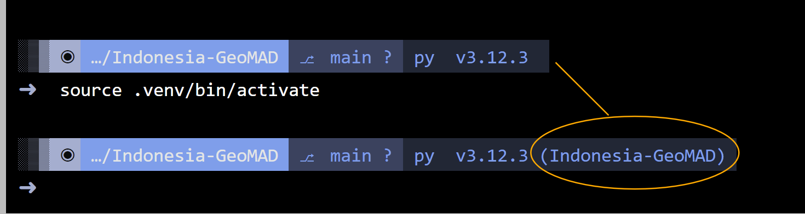
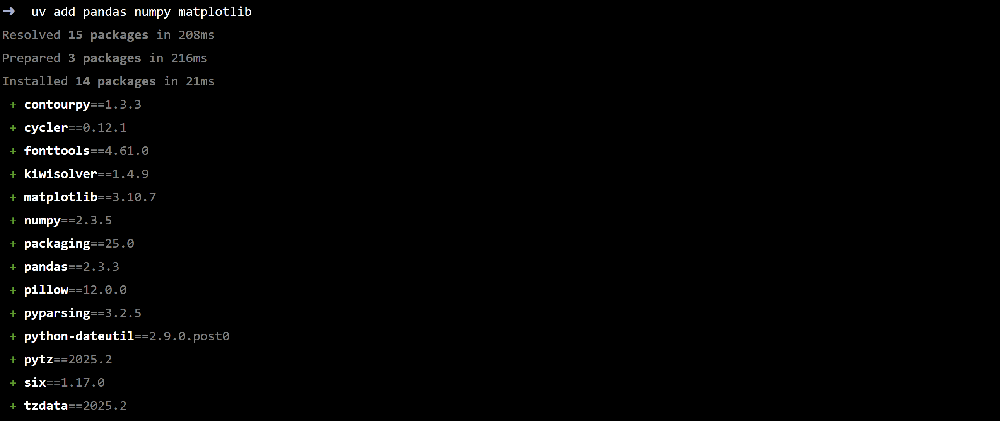
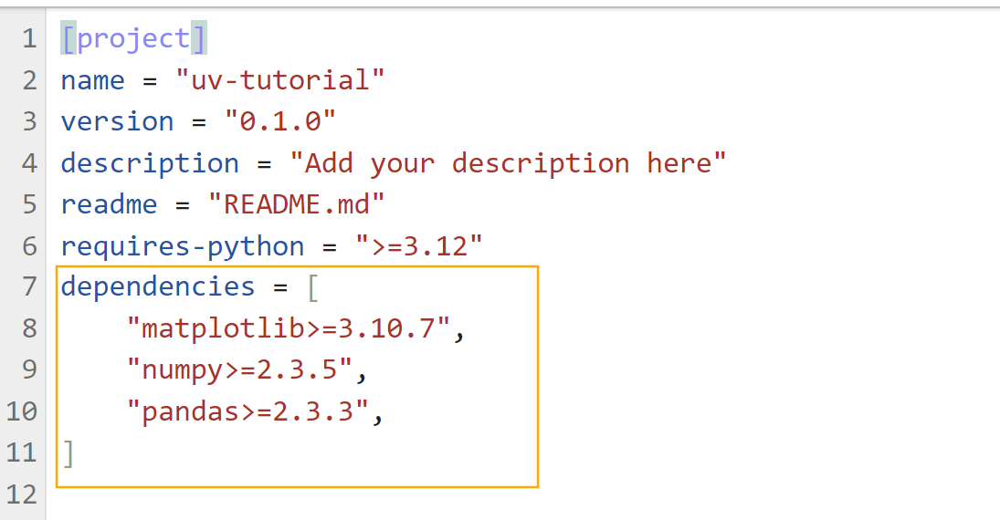
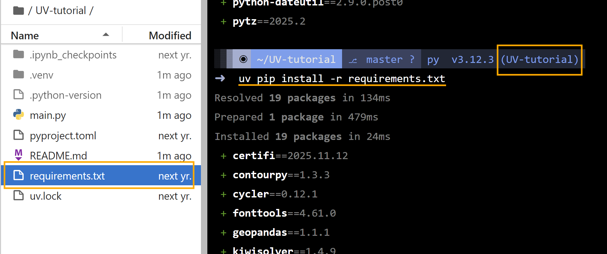
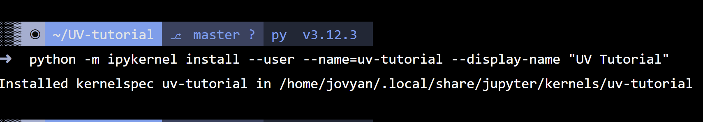
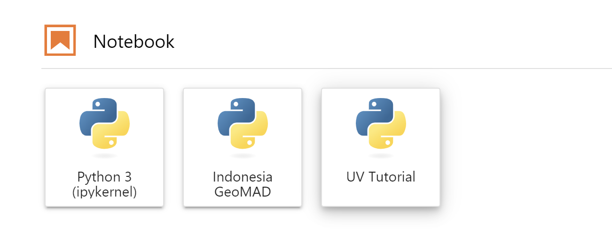
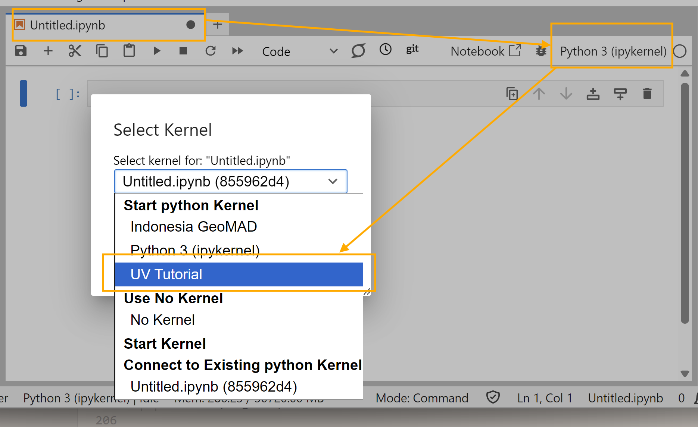

# Managing Environment With UV within Piksel Sandbox

|         |                           |
| :------ | :------------------------ |
| Version | 1.0                       |
| Date    | 5 December 2025           |
| Owner   | Cloud Infrastructure Team |

## A. Overview

In the Piksel Sandbox, we have prepared special instances dedicated to product development (you will see them marked with `For developer`).

You might notice these instances arrive with very few pre-installed libraries. This is intentional; we want to give you a clean slate to build exactly what you need, rather than untangling pre-existing dependencies. To support you in this, we have included `uv`, a tool designed to make managing environments and dependencies much smoother.

You also have full `sudo` access to install system-level packages, and we have included a visually stunning terminal to make your daily work a bit more pleasant.

## B. Managing Environment with UV

There are a few different scenarios you might encounter when setting up your work. If you are new to `uv`, do not worry—it is quite intuitive once you get the hang of it.

### 1. Start from Scratch

If you are beginning a fresh piece of work, here is the standard way to initialise your environment:

1.  **Initialise the project**

    ```bash
    uv init
    ```

    This command generates a `pyproject.toml` file, which acts as the recipe for your project. You will also see a `.python-version`, `main.py`, and a `README.md` appear in your folder. These extra files are not crucial, so it is safe to remove them if they are not needed.

2.  **Create your virtual environment**

    ```bash
    uv venv
    ```

    If you check your file explorer, you will now see a hidden folder named .venv. This is where your isolated environment lives, keeping your project separate from the rest of the system.

3.  **Activate the environment**

    ```bash
    source .venv/bin/activate
    ```

    

    The terminal interface will update to show you are now working inside the environment.

4.  Add your packages:

    ```bash
    uv add pandas numpy
    ```

    You will see uv resolving versions and downloading the files.

    

    Crucially, this automatically updates your `pyproject.toml` to include these new additions and creates a uv.lock file to ensure your environment is reproducible later.

    

### 2. Environment Dependencies Exist, but not UV managed

If you are bringing in a project that already has a **requirements.txt** file but has **not used uv** before, you can easily migrate it.

1.  Set up the project structure:

    ```bash
    uv init
    ```

2.  Create the virtual environment:

    ```bash
    uv venv
    ```

3.  Install your existing dependencies directly:

    ```bash
    uv pip install -r requirements.txt
    ```

    You will see the packages listed in your requirements file being installed into your environment. This gets your environment running immediately, but it does not track these packages in your new project file yet.

    

4.  To fully migrate to a uv project (**Recommended**):

    ```bash
    uv add -r requirements.txt
    ```

    Run this command if you want uv to take over management of these packages. It reads your requirements file and adds everything to pyproject.toml, ensuring your project is easier to maintain and update in the future.

### 3. Environment already managed with UV

If you are picking up a project that already has a **uv.lock** and/or **pyproject.toml** file, getting started is very straightforward.

1.  Sync the environment (this creates the .venv and ensures all versions match the lockfile):

    ```bash
    uv sync
    ```

    This looks at the lockfile and ensures your local .venv matches it exactly. It will install any missing packages and remove any that shouldn't be there.`

2.  Activate the environment:

    ```bash
    source .venv/bin/activate`
    ```

### 4. Deactivate and changing environment

When you are finished with a task or need to switch to a different project, it is good practice to exit your current environment.

1.  To exit the environment, simply type:

    ```bash
    deactivate
    ```

2.  To work on a different project, navigate to that project's folder and run the activation command again:

    ```bash
    source .venv/bin/activate
    ```

    

### 5. Other operations with UV

As you continue working, you might need these commands:

- To see exactly what is installed in your environment:

  ```bash
  uv pip list
  ```

- To remove a package:

  ```bash
  uv remove <package_name>
  ```

- To run a script inside the environment without manually activating it:

  ```bash
  uv run script.py
  ```

- To view your dependency tree:

  ```bash
  uv tree
  ```

## C. Using the venv within Jupyter Notebook

It is quite common to find that after installing a library in the terminal, it doesn't immediately appear in your Jupyter Notebook. This happens because the notebook uses a specific "kernel" that is separate from your terminal's environment.

We can bridge this gap with a few simple steps:

1.  Activate your environment in the terminal:

    ```bash
    source .venv/bin/activate
    ```

2.  Install the kernel package:

    ```bash
    uv add ipykernel
    ```

3.  Register the kernel so Jupyter can see it :

    ```bash
    python -m ipykernel install --user --name=my-env-name --display-name "Project X"
    ```

    - feel free to change `my-env-name` to something that describes your project,
    - display-name is what will be showed under kernel list

      **Example:**

      

      - In this example, I initialised the kernel with diplay-name = "UV Tutorial"

      - Success installation will enable me to create a new notebook using this kernel:

       

4.  **How about existing Notebook?**

    - Refresh your notebook page, go to the Kernel menu, and select your new kernel.

        

## D. Installing packages not managed by UV

Sometimes a Python package relies on system-level tools that `uv` cannot install on its own. Since you have `sudo` access, you are free to install whatever the system needs.

We use `apt-get` on these instances.

1.  It is always good practice to update the package list first:

    ```bash
    sudo apt-get update
    ```

2.  Install the package you need:

    ```
    sudo apt-get install <package_name>
    ```

## E. Common Issues

### GDAL Version Mismatch

Working with geospatial data can sometimes be a learning curve, particularly regarding versions. A common challenge arises when the Python `gdal` package does not match the system's `libgdal` version.

For example, if you are installing a tool like `odc-stats`, it requires `gdal`. To ensure it works correctly, we must align the Python package with the system library.

Here is how to handle it:

1.  First, check the version of the system library installed on the instance:

    ```bash
    gdal-config --version
    ```

    _(On our current instances, this returns 3.12.0)_

2.  When installing your package, explicitly pin `gdal` to match that version. This tells `uv` to install `odc-stats` but force the underlying `gdal` binding to be exactly 3.12.0:

    ```bash
    uv add odc-stats gdal==3.12.0
    ```

This approach ensures the Python bindings communicate perfectly with the system library. If things do not work the first time, remember that configuration issues are just part of the development journey.

---

> [!TIP]  
> If you face any issues around this, please do not hesitate to contact us. We are here to help you get set up.
