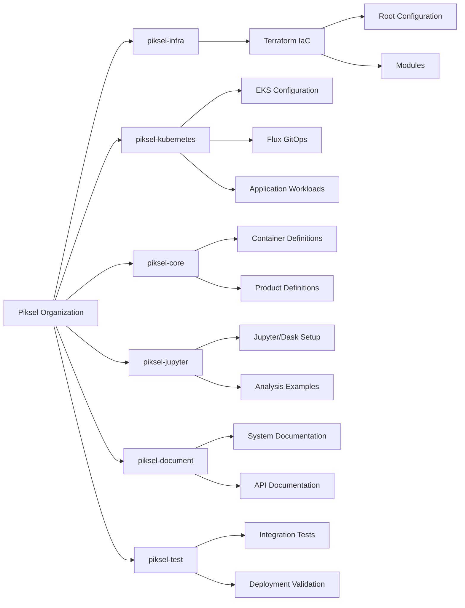
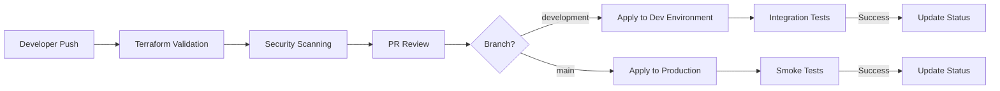
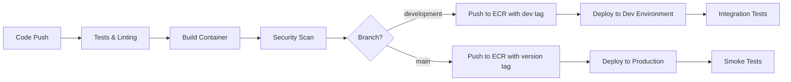
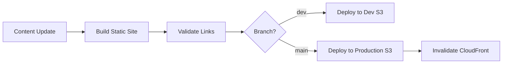

# Piksel Project Repository Strategy

## Overview

This document outlines the proposed multi-repository architecture for the Piksel Earth Observation Data platform. The strategy balances separation of concerns with system-wide coordination to enable efficient development and deployment of all components.

## Repository Structure



## Repository Details

### 1. `piksel-infra`

Infrastructure as Code repository containing all AWS resource definitions.

<!-- prettier-ignore-start -->
```markdown
piksel-infra/
├── main.tf           # All resource orchestration here
├── variables.tf
├── providers.tf
├── outputs.tf
└── modules/
    ├── network/
    ├── security/
    └── storage/
```
<!-- prettier-ignore-end -->

### 2. `piksel-core`

Open Data Cube core services repository.

<!-- prettier-ignore-start -->
```markdown
piksel-core/
├── docker/                     # Container definitions for ODC
├── products/                   # Earth observation product definitions
└── .github/workflows/          # Core services CI/CD pipelines
```
<!-- prettier-ignore-end -->

### 3. `piksel-jupyter`

Custom Jupyter environment with Dask integration.

<!-- prettier-ignore-start -->
```markdown
piksel-jupyter/
├── config/                     # JupyterHub/Dask config
├── notebooks/                  # Example and template notebooks
└── .github/workflows/          # Jupyter image CI/CD pipelines
```
<!-- prettier-ignore-end -->

### 4. `piksel-kubernetes`

Kubernetes and GitOps management:

<!-- prettier-ignore-start -->
```markdown
piksel-kubernetes/
├── terraform/           # EKS infrastructure
├── clusters/            # Flux configurations
└── workloads/           # Application manifests
```
<!-- prettier-ignore-end -->

### 5. `piksel-website`

Landing page and documentation site.

<!-- prettier-ignore-start -->
```markdown
piksel-website/
├── public/                     # Static website content
└── .github/workflows/          # Website deployment workflows
```
<!-- prettier-ignore-end -->

### 6. `piksel-test`

Testing and validation:

<!-- prettier-ignore-start -->
```markdown
piksel-test/
├── integration/        # Integration tests
└── deployment/         # Deployment validation
```
<!-- prettier-ignore-end -->

### 7. `piksel-document`

Centralized documentation:

<!-- prettier-ignore-start -->
```markdown
piksel-document/
├── security/           # Security foundations, policies, compliance
├── project-plans/      # Project plans, milestones 
├── achitecture/        # System architecture
├── operations/         # Runbooks, procedures, how-tos
├── assets/             # Logos, and etc
└── api/                # API documentation
```
<!-- prettier-ignore-end -->

## CI/CD Strategy

### Infrastructure Repository CI/CD



**Key Features:**

- **Validation**: Terraform validation, security scanning (tfsec, checkov)
- **Environment Promotion**: Changes flow from dev → production
- **OIDC Authentication**: Secure authentication to AWS without long-lived credentials
- **State Management**: Terraform Cloud for remote state and controlled execution
- **Pull Request Workflow**: Infrastructure changes require review and approval

### Service Repositories CI/CD



**Key Features:**

- **Container-Based**: All services are containerized for consistency
- **Version Tagging**: Semantic versioning for production images
- **Automated Testing**: Unit tests, integration tests, and security scanning
- **ECR Integration**: Direct push to Amazon ECR with appropriate tags
- **Deployment Automation**: Automated deployment to the target environment

### Static Website CI/CD



**Key Features:**

- **Static Site Generation**: Build process for static content
- **S3 Deployment**: Direct upload to S3 bucket
- **CloudFront Integration**: Cache invalidation after deployment
- **Content Validation**: Link checking and content validation

## Coordination Strategy

The meta repository serves as the coordination point with:

1. **System Documentation**: Comprehensive documentation of all components
2. **Deployment Orchestration**: Scripts to coordinate deployments across repositories
3. **Cross-Repository Automation**: GitHub Actions workflows that can trigger events in multiple repositories
4. **Developer Onboarding**: Complete setup instructions for the development environment
5. **Monitoring Configuration**: Centralized monitoring and alerting configuration

## Migration Plan

1. **Phase 1** (EC2): Initialize repositories with base structure and EC2 deployment
2. **Phase 2** (Kubernetes): Add Kubernetes deployment configurations while maintaining EC2 compatibility
3. **Gradual Migration**: Move from EC2 to Kubernetes one service at a time

This structure provides the flexibility to evolve each component independently while maintaining overall system coherence through the meta repository.
