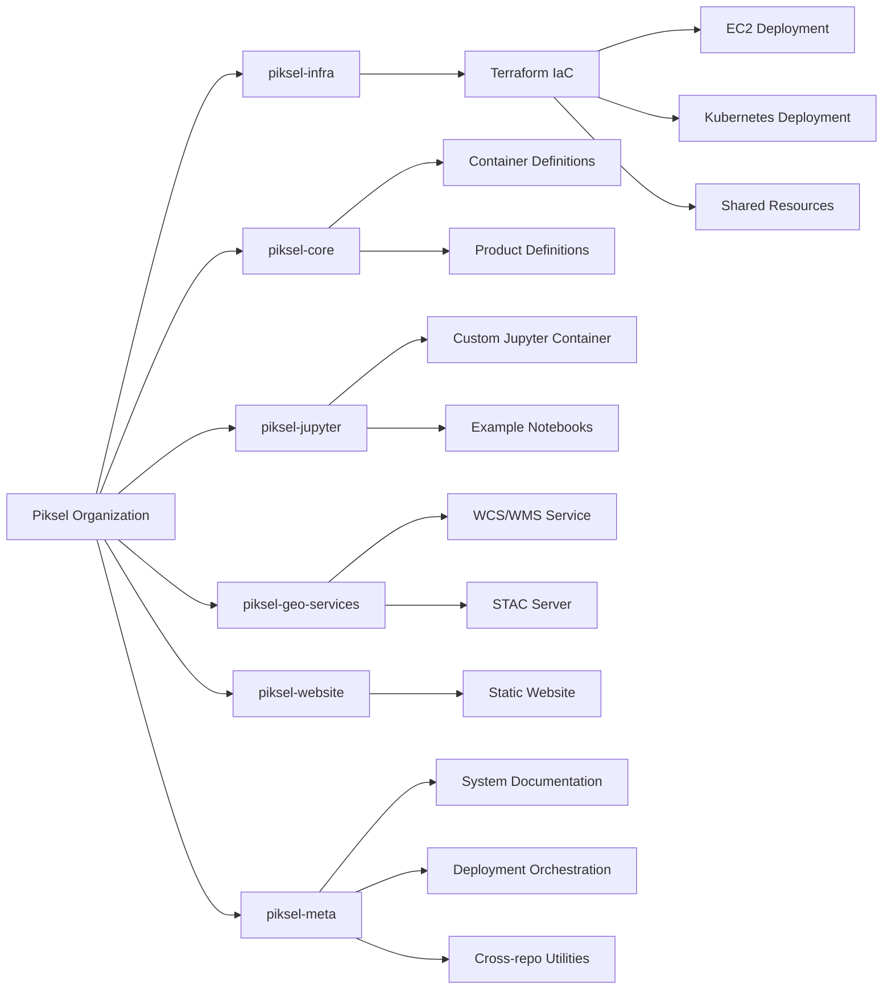
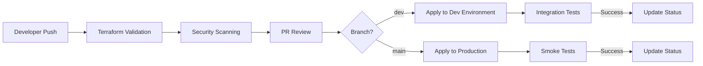
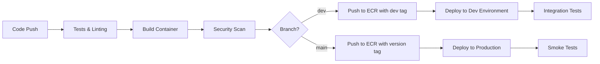
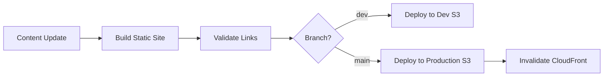

# Piksel Project Repository Strategy

## Overview

This document outlines the proposed multi-repository architecture for the Piksel Earth Observation Data platform. The strategy balances separation of concerns with system-wide coordination to enable efficient development and deployment of all components.

## Repository Structure



## Repository Details

### 1. `piksel-infra`

Infrastructure as Code repository containing all AWS resource definitions.

<!-- prettier-ignore-start -->
```markdown
piksel-infra/
├── terraform/
│   ├── network/                # Maps to piksel-network-dev workspace
│   │   ├── modules/network            
│   │   ├── main.tf             # Calls network module
│   │   ├── variables.tf
│   │   ├── outputs.tf
│   │   ├── terraform.tf        # Backend config for piksel-network-dev
│   │   ├── dev.tfvars          # Development-specific variables
│   │   └── prod.tfvars         # Production-specific variables
│   │
│   ├── shared/                 # Maps to piksel-shared-dev workspace
│   │   ├── modules/shared
│   │   ├── main.tf             # Calls shared module
│   │   ├── variables.tf
│   │   ├── outputs.tf
│   │   ├── terraform.tf        # Backend config for piksel-network-dev
│   │   ├── dev.tfvars          # Development-specific variables
│   │   └── prod.tfvars         # Production-specific variables
│   │
│   ├── compute/                # Maps to piksel-compute-dev workspace
│   │   ├── modules/compute
│   │   ├── main.tf             # Calls compute module
│   │   ├── variables.tf
│   │   ├── outputs.tf
│   │   └── terraform.tf
│   │
│   └── kubernetes/             # Maps to piksel-kubernetes-dev workspace (future)
│       ├── modules/kubernetes
│       ├── main.tf             # Calls kubernetes and kubernetes-addons modules
│       ├── variables.tf
│       ├── outputs.tf
│       ├── terraform.tf        # Backend config for piksel-network-dev
│       ├── dev.tfvars          # Development-specific variables
│       └── prod.tfvars         # Production-specific variables
│
└── .github/
    └── workflows/
        ├── terraform-plan.yml         # Runs on PRs
        ├── terraform-apply-dev.yml    # Runs on merges to develop
        └── terraform-apply-prod.yml   # Runs on merges to main
```
<!-- prettier-ignore-end -->

### 2. `piksel-core`

Open Data Cube core services repository.

<!-- prettier-ignore-start -->
```markdown
piksel-core/
├── docker/                     # Container definitions for ODC
├── products/                   # Earth observation product definitions
└── .github/workflows/          # Core services CI/CD pipelines
```
<!-- prettier-ignore-end -->

### 3. `piksel-jupyter`

Custom Jupyter environment with Dask integration.

<!-- prettier-ignore-start -->
```markdown
piksel-jupyter/
├── docker/                     # Custom Jupyter container with Dask support
├── notebooks/                  # Example and template notebooks
└── .github/workflows/          # Jupyter image CI/CD pipelines
```
<!-- prettier-ignore-end -->

### 4. `piksel-geo-services`

Geospatial services for data access and cataloging.

<!-- prettier-ignore-start -->
```markdown
piksel-geo-services/
├── wcs-wms/                    # Web Coverage/Map Service implementation
├── stac/                       # SpatioTemporal Asset Catalog service
└── .github/workflows/          # Geo-services CI/CD pipelines
```
<!-- prettier-ignore-end -->

### 5. `piksel-website`

Landing page and documentation site.

<!-- prettier-ignore-start -->
```markdown
piksel-website/
├── public/                     # Static website content
└── .github/workflows/          # Website deployment workflows
```
<!-- prettier-ignore-end -->

### 6. `piksel-meta`

Coordination repository for system-wide concerns.

<!-- prettier-ignore-start -->
```markdown
piksel-meta/
├── docs/                       # System-wide documentation
│ ├── architecture/             # System architecture diagrams
│ ├── deployment/               # End-to-end deployment guides
│ └── operations/               # Day 2 operations documentation
├── deployment/                 # Deployment orchestration
│ ├── scripts/                  # Deployment automation scripts
│ └── config/                   # Environment configuration templates
└── scripts/                    # Cross-repository utilities
├── development/                # Developer environment setup
└── monitoring/                 # System monitoring configuration
```
<!-- prettier-ignore-end -->

## CI/CD Strategy

### Infrastructure Repository CI/CD



**Key Features:**

- **Validation**: Terraform validation, security scanning (tfsec, checkov)
- **Environment Promotion**: Changes flow from dev → production
- **OIDC Authentication**: Secure authentication to AWS without long-lived credentials
- **State Management**: Terraform Cloud for remote state and controlled execution
- **Pull Request Workflow**: Infrastructure changes require review and approval

### Service Repositories CI/CD



**Key Features:**

- **Container-Based**: All services are containerized for consistency
- **Version Tagging**: Semantic versioning for production images
- **Automated Testing**: Unit tests, integration tests, and security scanning
- **ECR Integration**: Direct push to Amazon ECR with appropriate tags
- **Deployment Automation**: Automated deployment to the target environment

### Static Website CI/CD



**Key Features:**

- **Static Site Generation**: Build process for static content
- **S3 Deployment**: Direct upload to S3 bucket
- **CloudFront Integration**: Cache invalidation after deployment
- **Content Validation**: Link checking and content validation

## Coordination Strategy

The meta repository serves as the coordination point with:

1. **System Documentation**: Comprehensive documentation of all components
2. **Deployment Orchestration**: Scripts to coordinate deployments across repositories
3. **Cross-Repository Automation**: GitHub Actions workflows that can trigger events in multiple repositories
4. **Developer Onboarding**: Complete setup instructions for the development environment
5. **Monitoring Configuration**: Centralized monitoring and alerting configuration

## Migration Plan

1. **Phase 1** (EC2): Initialize repositories with base structure and EC2 deployment
2. **Phase 2** (Kubernetes): Add Kubernetes deployment configurations while maintaining EC2 compatibility
3. **Gradual Migration**: Move from EC2 to Kubernetes one service at a time

This structure provides the flexibility to evolve each component independently while maintaining overall system coherence through the meta repository.
