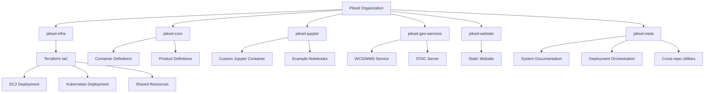
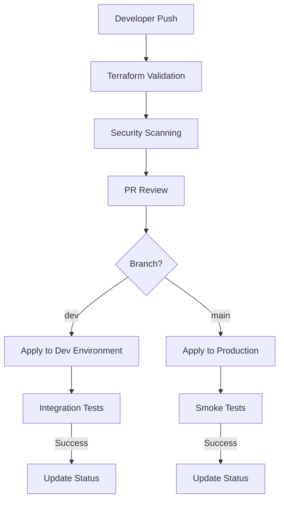
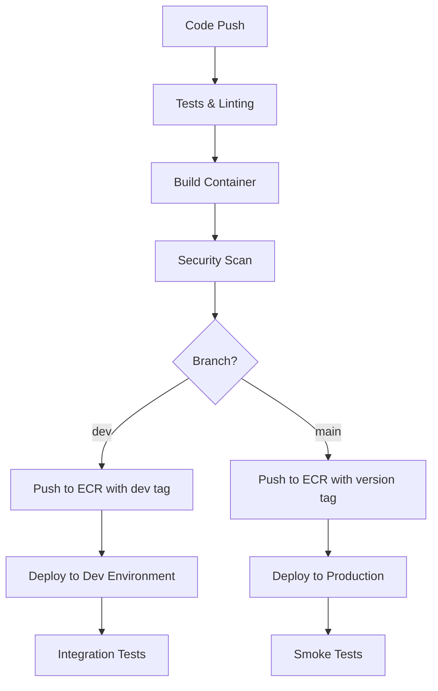
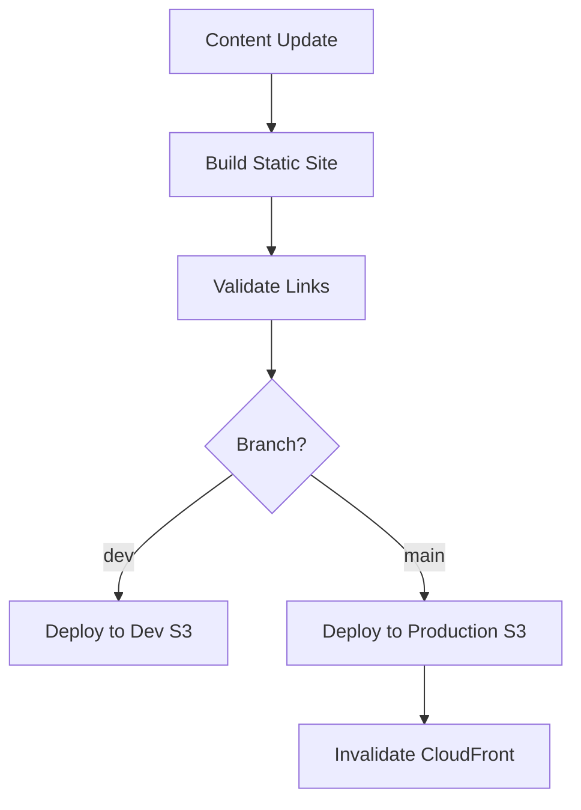

# Piksel Project Repository Strategy

## Overview

This document outlines the proposed multi-repository architecture for the Piksel Earth Observation Data platform. The strategy balances separation of concerns with system-wide coordination to enable efficient development and deployment of all components.

## Repository Structure



## Repository Details

### 1. `piksel-infra`

Infrastructure as Code repository containing all AWS resource definitions.

```markdown
piksel-infra/
├── terraform/
│ ├── ec2-deployment/ # Phase 1: EC2-based deployment resources
│ ├── kubernetes-deployment/ # Phase 2: Kubernetes resources  
│ └── shared-resources/ # Shared infrastructure (ECR, S3, IAM, etc.)
└── .github/workflows/ # Infrastructure CI/CD pipelines
```

### 2. `piksel-core`

Open Data Cube core services repository.

```markdown
piksel-core/
├── docker/ # Container definitions for ODC
├── products/ # Earth observation product definitions
└── .github/workflows/ # Core services CI/CD pipelines
```

### 3. `piksel-jupyter`

Custom Jupyter environment with Dask integration.

```markdown
piksel-jupyter/
├── docker/ # Custom Jupyter container with Dask support
├── notebooks/ # Example and template notebooks
└── .github/workflows/ # Jupyter image CI/CD pipelines
```

### 4. `piksel-geo-services`

Geospatial services for data access and cataloging.

```markdown
piksel-geo-services/
├── wcs-wms/ # Web Coverage/Map Service implementation
├── stac/ # SpatioTemporal Asset Catalog service
└── .github/workflows/ # Geo-services CI/CD pipelines
```

### 5. `piksel-website`

Landing page and documentation site.

```markdown
piksel-website/
├── public/ # Static website content
└── .github/workflows/ # Website deployment workflows
```

### 6. `piksel-meta`

Coordination repository for system-wide concerns.

```markdown
piksel-meta/
├── docs/ # System-wide documentation
│ ├── architecture/ # System architecture diagrams
│ ├── deployment/ # End-to-end deployment guides
│ └── operations/ # Day 2 operations documentation
├── deployment/ # Deployment orchestration
│ ├── scripts/ # Deployment automation scripts
│ └── config/ # Environment configuration templates
└── scripts/ # Cross-repository utilities
├── development/ # Developer environment setup
└── monitoring/ # System monitoring configuration
```

## CI/CD Strategy

### Infrastructure Repository CI/CD



**Key Features:**

- **Validation**: Terraform validation, security scanning (tfsec, checkov)
- **Environment Promotion**: Changes flow from dev → production
- **OIDC Authentication**: Secure authentication to AWS without long-lived credentials
- **State Management**: Terraform Cloud for remote state and controlled execution
- **Pull Request Workflow**: Infrastructure changes require review and approval

### Service Repositories CI/CD



**Key Features:**

- **Container-Based**: All services are containerized for consistency
- **Version Tagging**: Semantic versioning for production images
- **Automated Testing**: Unit tests, integration tests, and security scanning
- **ECR Integration**: Direct push to Amazon ECR with appropriate tags
- **Deployment Automation**: Automated deployment to the target environment

### Static Website CI/CD



**Key Features:**

- **Static Site Generation**: Build process for static content
- **S3 Deployment**: Direct upload to S3 bucket
- **CloudFront Integration**: Cache invalidation after deployment
- **Content Validation**: Link checking and content validation

## Coordination Strategy

The meta repository serves as the coordination point with:

1. **System Documentation**: Comprehensive documentation of all components
2. **Deployment Orchestration**: Scripts to coordinate deployments across repositories
3. **Cross-Repository Automation**: GitHub Actions workflows that can trigger events in multiple repositories
4. **Developer Onboarding**: Complete setup instructions for the development environment
5. **Monitoring Configuration**: Centralized monitoring and alerting configuration

## Advantages of Multi-Repository Approach

1. **Clear Separation of Concerns**: Each component has its own lifecycle and release cadence
2. **Specialized CI/CD Pipelines**: Tailored workflows for each component type
3. **Independent Development**: Teams can work on different components without interference
4. **Repository Size Management**: Prevents any single repository from becoming unwieldy
5. **Focused Pull Requests**: Reviews are focused on specific component changes
6. **Access Control**: Fine-grained access control for different components

## Migration Plan

1. **Phase 1** (EC2): Initialize repositories with base structure and EC2 deployment
2. **Phase 2** (Kubernetes): Add Kubernetes deployment configurations while maintaining EC2 compatibility
3. **Gradual Migration**: Move from EC2 to Kubernetes one service at a time

This structure provides the flexibility to evolve each component independently while maintaining overall system coherence through the meta repository.
